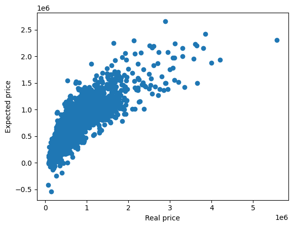

# Linear Regression with SKLearn for House Price Prediction

**INTRODUCTION**
<br>
The objective of this report is to present a code developed to predict house prices using a dataset provided by the data science learning platform Kaggle. The dataset contains information about houses sold in the United States of America between May 2014 and May 2015. The code was written in Python, utilizing the libraries numpy, matplotlib, pandas, and sklearn.
<br><br>

**DEVELOPMENT**

The first step of the code is to implement the libraries, which are:
```python
import numpy as np
import matplotlib.pyplot as plt
import pandas as pd
from sklearn.model_selection import train_test_split
from sklearn.linear_model import LinearRegression
```

❖ Numpy: NumPy is a library for the Python programming language that supports the processing of multi-dimensional arrays and matrices, along with a large collection of mathematical functions/operations.

❖ Matplotlib: Matplotlib is a library for creating graphs and data visualizations in general.

❖ Pandas: Pandas is a library that facilitates the manipulation and analysis of structured or tabular data.

❖ Sklearn: Scikit-learn is an open-source library that contains tools for machine learning, such as functions for data preprocessing, model creation, result evaluation, etc.

The second step is to load the dataset and create a Pandas DataFrame from a CSV (comma-separated values) file provided by the Kaggle website, named “kc_house_data.csv”, containing one row for each house and one column for each variable:

```python
data=pd.read_csv("kc_house_data.csv")
```

Next, the pd.set_option command is used to display the maximum number of columns and rows in the table. In this case, 21 columns and 21 rows:
```python
pd.set_option('display.max_columns',21)
pd.set_option('display.max_rows',21)
```

The third step of the code is to explore the data and check for missing values that could compromise the data quality or the accuracy of the R². For this, the code uses the Pandas function data.isnull().sum():
```python
missing_data=data.isnull().sum()
```

Subsequently, missing_data is called to analyze if there are any missing values:
```python
missing_data
```
```
id               0
date             0
price            0
bedrooms         0
bathrooms        0
sqft_living      0
sqft_lot         0
floors           0
waterfront       0
view             0
condition        0
grade            0
sqft_above       0
sqft_basement    0
yr_built         0
yr_renovated     0
zipcode          0
lat              0
long             0
sqft_living15    0
sqft_lot15       0
dtype: int64
```

The output shows that there are no null values, meaning there are no missing data.


The fourth step is to eliminate columns that are not relevant for predicting house prices, as they can add noise or unnecessary complexity to the data. The columns eliminated were:

❖ id: An identifier for each house, which has no relation to the house price.

❖ date: The date the house was sold, which may or may not influence the house price, but is not a continuous variable and may require special treatment.

❖ zipcode: The postal code of the house’s location, which may or may not influence the house price, but is not necessary due to information from other columns and may require special treatment.

To eliminate the unwanted columns, the drop function from the Pandas library was used:
```python
data.drop('id',axis=1,inplace=True)
data.drop('date',axis=1,inplace=True)
data.drop('zipcode',axis=1,inplace=True)
```

In this function, the argument axis=1 indicates that columns are the axis to be eliminated, and the argument inplace=True indicates that the changes should be made to the original DataFrame.

The fifth step is to separate the independent variables (features) from the dependent variable (target). In this case, the independent variables are the characteristics of the houses that may influence their price, such as the number of bedrooms, location, etc. Thus, the dependent variable is the house price:

```python
x = data.drop('price', axis=1)
y = data['price']
```

Here, the code uses the drop function from the Pandas library to create a new DataFrame x without the price column named “price”. Using square brackets, the “price” column from the original DataFrame is accessed and a series y is created, containing the dependent variable.

The sixth step is to split the data into training and testing sets using the train_test_split function from the Sklearn library. The training data is used to fit the model parameters, and the testing data is used to measure the model’s ability to generalize to new cases. The following parameters were used:

❖ test_size: Here, a proportion of 30% of the data is used for testing.

❖ random_state: An integer that defines the seed for the random number generator, which is used to shuffle and split the data (in this case, 5).

```python
x_train,x_test,y_train,y_test=train_test_split(x,y, test_size=0.30, random_state=5)
```

The seventh step is to create and train a linear regression model using LinearRegression from the Sklearn library. This allows the creation of an object that represents a linear regression model and provides methods to fit the model parameters to the data and make predictions:

```python
model= LinearRegression()
model.fit(x_train, y_train)
```

Here, an object called model is created, representing a linear regression model. The fit method is also used to adjust the model parameters to the training data, calculating the coefficients of the line equation that best fits the data and minimizing the mean squared error between the actual and predicted values.

The eighth step is to make predictions for the test data and compare them with the actual values. The scatter function from the Matplotlib library is used to create a plot that shows the relationship between the actual price and the predicted price. The predict method receives the DataFrame with the test data variables as a parameter and returns the predicted values from the line equation:

```python
y_pred = model.predict(x_test)
plt.scatter(y_test, y_pred)
plt.xlabel('Real price')
plt.ylabel('Expected price')
plt.show()
```

Here, plt.show() will display the plot:



Analyzing the plot, it is noted that there is a positive relationship between the actual price and the predicted price. However, there is some dispersion among the points on the actual price line, which may indicate a lack of precision in the model in capturing the data variation.

The final step is to calculate the coefficient of determination (R²) to evaluate the performance of this model. The R² value ranges from 0 to 1, and the closer it is to 1, the better the fit to the data.

In the code, the score function from the Sklearn library was used to calculate the R²:
```python
r2 = model.score(x_test, y_test)
print('R2 accuracy/value =', r2)
```

When the R² value is printed, it returns ```R² Value = 0.7040174414788027```, indicating that there is a 70.40% accuracy in the variation of house prices. Therefore, it is concluded that this model has a reasonable performance but can still be improved.
