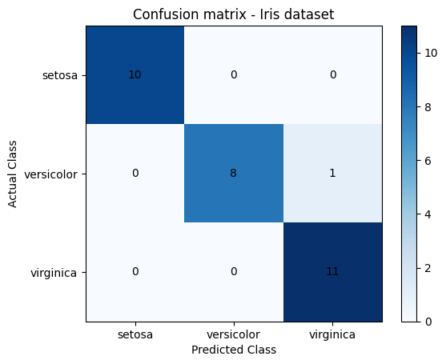

## IRIS FLOWER

**INTRODUCTION**

The objective of this report is to present a code developed to train a KNN classification model for the Iris dataset, using cross-validation with about 5 splits to find the best parameters. Subsequently, the model is trained with the best parameters found and used to predict the classes of the flowers with the test data. The confusion matrix of the KNN model is then generated and the result interpreted. The code was written in Python, using the libraries numpy, matplotlib, pandas, and sklearn.

**DEVELOPMENT**

The first step of the code is to implement the libraries, which are: 

```python
import numpy as np
import matplotlib.pyplot as plt
import pandas as pd
from sklearn.model_selection import train_test_split, GridSearchCV
from sklearn.neighbors import KNeighborsClassifier, DistanceMetric
from sklearn.datasets import load_iris
from sklearn.metrics import confusion_matrix
```

❖ Numpy - NumPy is a library for the Python programming language that supports the processing of multi-dimensional arrays and matrices, along with a large collection of mathematical functions/operations. 

❖ Matplotlib - Matplotlib is a library for creating graphs and data visualizations in general. 

❖ Pandas - Pandas is a library that facilitates the manipulation and analysis of structured or tabular data. 

❖ SKLearn - Scikit-Learn is an open-source library that contains tools for machine learning, such as functions for data preprocessing, model creation, result evaluation, etc.

The second step is to load the Iris dataset, which contains information about the characteristics of three species (classes) of Iris flowers, namely: Iris Setosa, Iris Versicolor, and Iris Virginica, each containing 50 samples, as well as some characteristics of each flower, such as sepal length, sepal width, petal length, and petal width. Thus, the variable “x” was created to store the characteristics of the Iris flowers as a dataframe. The variable “y” was created to store the species (classes) of the Iris flowers as a series. Each value in the series represents a different class. Subsequently, the classes of the Iris flowers are printed:

```python
iris = load_iris()
x = pd.DataFrame(iris.data, columns=[iris.feature_names])
y = pd.Series(iris.target)
print(iris.target_names)
```

The third step of the code is to create an object with the parameters to be tested. Thus, the variable “parameters” contains the ‘n_neighbors’ parameter, with the values [1,3,5,7,9]. In this way, the ‘n_neighbors’ parameter is the number of nearest neighbors to be considered for the classification of a new point. The ‘weights’ parameter defines how the neighbors are weighted during classification, using the values “uniform” and “distance”, which respectively assign the same weight to all neighbors, while the other assigns weights inversely proportional to the distance between the new point and its neighbors:

```python
parameters = {'n_neighbors': [1, 3, 5, 7, 9], 'weights': ['uniform', 'distance'], 'metric': ['euclidean', 'manhattan', 'minkowski', 'chebyshev']}
knn = KNeighborsClassifier()
```

The fourth step is to find the best parameters by creating a GridSearchCV stored in the ‘grid’ variable:

```python
grid = GridSearchCV(knn, parameters, cv=5)
```

The fifth step is to train the model with the Iris data and find the best parameters:
grid.fit(x, y)

The sixth step is to see the best values of ‘k’ and distance metric, printing the best parameters:
```python
print("Best parameters: ",grid.best_params_)
```
```
Best parameters:  {'metric': 'chebyshev', 'n_neighbors': 5, 'weights': 'uniform'}
```
Here, it is indicated that the best distance metric is ‘chebyshev’, which is used to determine which points are considered the nearest neighbors. The best n_neighbors: 5, that is, considering the 5 nearest neighbors resulted in better model performance. The best “weights” is ‘uniform’, which indicates that assigning equal weights to all neighbors resulted in better model performance.

The seventh step is to split the dataset into training and testing sets (80% and 20%):
```python
x_train, x_test, y_train, y_test = train_test_split(x, y, test_size=0.2, random_state=42)
```

The eighth step is to train the model with the best parameters using the training data:
```python
best = grid.best_estimator_
best.fit(x_train, y_train)
```
```
KNeighborsClassifier(metric='chebyshev')
```
The ninth step is to make predictions of the flower classes using the test data:

```python
y_prev = best.predict(x_test)
```

The tenth step is to generate the confusion matrix of the model:

```python
confusion = confusion_matrix(y_test, y_prev)
print("Confusion matrix: ",confusion)
```

```
Confusion matrix:
[[10  0  0]
 [ 0  8  1]
 [ 0  0 11]]

```

The eleventh step is to plot the confusion matrix of the KNN model:

```python
plt.imshow(confusion, cmap='Blues')
plt.colorbar()
plt.xticks([0, 1, 2], iris.target_names)
plt.yticks([0, 1, 2], iris.target_names)
plt.xlabel('Predicted Class')
plt.ylabel('Actual Class')
plt.title('Confusion matrix - Iris dataset')

for i in range(3):
    for j in range(3):
        plt.text(j, i, confusion[i, j], ha="center", va="center", color="black")

plt.show()
```

Here, the confusion matrix is plotted, which is a table that shows the number of correct and incorrect predictions made by the model. The main diagonal of the matrix contains the number of correct predictions, while the other cells contain the number of incorrect predictions. The imshow function from the matplotlib library is used to create a colored bar chart representing the confusion matrix. A color bar is also added to help interpret the chart. The x and y axis labels are set as the class names (Setosa, Versicolor, and Virginica), adding the label “predicted class” to the x-axis and “actual class” to the y-axis, along with a title (“Confusion Matrix - Iris Dataset”) to indicate that it is a confusion matrix of this model. In plt.show(), the following confusion matrix is displayed:



In the confusion matrix, we can obtain information such as: 

❖ True Positives (TP): The number of samples correctly classified as positive. 

❖ False Positives (FP): The number of samples incorrectly classified as positive. 

❖ True Negatives (TN): The number of samples correctly classified as negative. 

❖ False Negatives (FN): The number of samples incorrectly classified as negative.

Based on the generated confusion matrix, we can conclude that:

❖ The *Setosa* class was correctly classified in all samples (10 true positives); 

❖ The *Versicolor* class was correctly classified in 8 samples and incorrectly in 1 sample of the Virginica class (8 true positives and 1 false positive); 

❖ The *Virginica* class was correctly classified in all samples, except for 1 sample, which was incorrectly classified as Versicolor (11 true positives and no false positives).

The final step is to calculate the accuracy by dividing the sum of true positives (TP) and true negatives (TN) by the total number of samples, using the following formula: accuracy = (TP + TN) / (TP + TN + FP + FN).
```python
accuracy = confusion.diagonal().sum() / confusion.sum()
print("KNN model accuracy: ", accuracy)
```
```
KNN model accuracy:  0.9666666666666667
```
When the accuracy value is printed, it returns 0.9666666666666667, indicating that approximately 96.67% (29 out of 30 samples in the test set) of the samples in the load_iris dataset were correctly classified. Therefore, it can be concluded that this model has good performance in classifying Iris flowers.