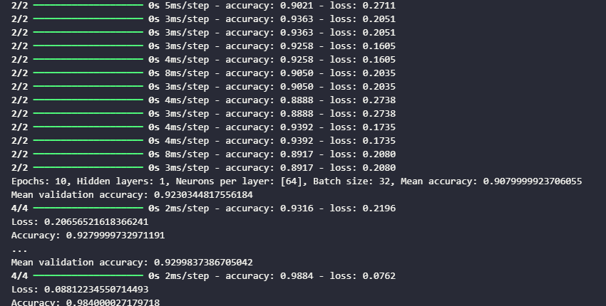
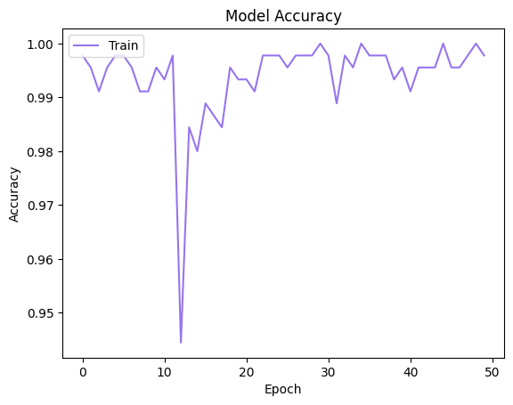

# INTRODUCTION

The objective of this report is to present a code developed to train a neural network model that can accurately predict the direction in which the balance scale is tilted based on the data provided by the Balance Scale Data dataset, which contains information about different weights and distances used on a balance scale to determine if the scale tilts to the left, right, or is balanced.

Thus, the model's performance was evaluated using cross-validation, the results were stored in a list and used to calculate the model's mean accuracy, and the model's performance was evaluated again using the test data. Subsequently, the loss and accuracy were printed. A graph of the neural network model's accuracy over the epochs was then generated, which was plotted using the Matplotlib library. The code was written in Python, using the pandas, matplotlib, keras, and sklearn libraries.

# DEVELOPMENT

The first step of the code is to implement the libraries, which are:

```python
import pandas as pd
import matplotlib.pyplot as plt
from sklearn.model_selection import train_test_split, StratifiedKFold, cross_val_score
from keras.models import Sequential
from keras.layers import Dense, Dropout
from keras import regularizers
from keras.optimizers import SGD, Nadam, Adam
```

❖ Pandas - Pandas is a library that facilitates the manipulation and analysis of structured or tabular data.

❖ Matplotlib - Matplotlib is a library for creating graphs and general data visualization.

❖ Keras - Keras is an open-source neural network library written in Python, with a simple and consistent interface optimized for quick experimentation with deep neural networks.

❖ Sklearn - Scikit-learn is an open-source library that contains tools for machine learning, such as functions for data preprocessing, model creation, result evaluation, etc.

# DEVELOPMENT

The second step is to load the Balance Scale dataset. Thus, the balance-scale.data file is read using the ```read_csv()``` function. The 'names' parameter is used to specify the column names, and the columns are named ```Class```, ```Left-W```, ```Left-D```, ```Right-W```, and ```Right-D```. Then, the variable "x" is created to store the characteristics of the scales. The drop() function is used to remove the ```Class``` column from the dataframe data. The variable "y" is created to store the direction in which the scale is tilted, and then the ```Class``` column is assigned to the variable "y".

```python
data = pd.read_csv('C:\\Users\\julia\\Documents\\GitHub\\machine-learning-uergs\\Neural Networks - Balance Scale\\balance_scale\\balance-scale.data', names=['Class', 'Left-W', 'Left-D', 'Right-W', 'Right-D'])
x = data.drop('Class', axis=1)
y = data['Class']
```

Next, the target vector is updated to numerical values and the data is split into training and test sets:

```python
y.replace({'L': 0, 'B': 1, 'R': 2}, inplace=True)
x_train, x_test, y_train, y_test = train_test_split(x, y, test_size=0.2, random_state=42)
```

The fourth step is to define the number of epochs, hidden layers, number of neurons in each layer, and batch size:

```python
num_epochs = [10, 50]
num_hidden_layers = [1, 2]
num_neurons_per_layer = [[64], [64, 32]]
batch_size = [32, 64]
```

The fifth step is to split the data into “k” equal parts:
```python
kfold = StratifiedKFold(n_splits=10, shuffle=True)
```

The sixth step is to use 3 different optimizers, creating a list called “optimizers”, with the aim of fitting the model to the training data and evaluating the model’s performance using the test data. The optimizers used were:

❖ SGD Optimizer (Stochastic Gradient Descent) is an optimization algorithm that updates the model’s weights at each epoch based on the gradient of the loss function. The ‘momentum’ parameter is used to accelerate the convergence of this algorithm;

❖ Adam Optimizer (Adaptive Moment Estimation) is an optimization algorithm that updates the learning rates of the model’s weights based on the gradient of the loss function and the moving mean of previous gradients;

❖ Nadam Optimizer (Nesterov-accelerated Adaptive Moment Estimation) is a variation of the Adam optimizer that combines the Nesterov Accelerated Gradient (NAG) method with the Adaptive Moment Estimation (Adam) method, used to accelerate the convergence of the algorithm.

```python
optimizers = [SGD(momentum=0.9), Nadam(), Adam()]
val_accuracy = []
```

The seventh step is to iterate over all combinations of the hyperparameter values: "optimizers", "num_epochs", "num_hidden_layers", "num_neurons_per_layer", and "batch_size" to create neural network models:

```python
from keras.layers import Input

for optimizer in optimizers:
  for epochs in num_epochs:
    for hidden_layers in num_hidden_layers:
        for neurons_per_layer in num_neurons_per_layer:
            for batch in batch_size:
                # Creating the neural network model.
                model = Sequential()
                model.add(Input(shape=(4,)))
                model.add(Dense(neurons_per_layer[0], activation='relu'))
                for i in range(hidden_layers - 1):
                  if i + 1 < len(neurons_per_layer):
                    model.add(Dense(neurons_per_layer[i + 1], activation='relu'))
                    model.add(Dropout(0.2))
                model.add(Dense(3, activation='softmax'))
 ```

The model is also composed of an input layer, several hidden layers, and an output layer. The activation function used in the hidden layers is the ReLU function, while the activation function used in the output layer is the Softmax function. Subsequently, the "sparse_categorical_crossentropy" loss function, the "adam" optimizer, and the "accuracy" metric are used:

 ```python
                # Compiling the neural network model.
                model.compile(loss='sparse_categorical_crossentropy', optimizer='adam', metrics=['accuracy'])
```

The model’s performance is evaluated using cross-validation. The cross-validation result is stored in a list called “results”. The mean accuracy is calculated and stored in the variable mean. The mean accuracy on the validation data is calculated and stored in the variable “mean_val_accuracy”.

Thus, the “val_accuracy” metric is a measure of the model’s accuracy on a validation dataset, used to evaluate the model’s performance on data that was not used to train it. The “accuracy” metric is a measure of the model’s accuracy on the training data, used to evaluate the model’s performance on the data that was used to train it. Finally, information about the hyperparameter combinations and their respective mean accuracies is printed:

```python
                # Evaluating the model's performance using cross-validation.
                results = []
                for train, test in kfold.split(x_train, y_train):
                    history = model.fit(x_train.iloc[train], y_train.iloc[train], epochs=epochs, batch_size=batch, verbose=0)
                    result = model.evaluate(x_train.iloc[test], y_train.iloc[test])
                    results.append(result[1])
                    val_accuracy.append(model.evaluate(x_train.iloc[test], y_train.iloc[test])[1])
                mean_accuracy = sum(results) / len(results)
                print(f'Epochs: {epochs}, Hidden layers: {hidden_layers}, Neurons per layer: {neurons_per_layer}, Batch size: {batch}, Mean accuracy: {mean_accuracy}')
                mean_val_accuracy = sum(val_accuracy) / len(val_accuracy)
                print(f'Mean validation accuracy: {mean_val_accuracy}')
                # Evaluating the neural network model's performance using the test data.
                result = model.evaluate(x_test, y_test)
                print('Loss:', result[0])
                print('Accuracy:', result[1])
```
```(Example of part of the code execution)```


As a result, there was an mean accuracy between 0.87 and 0.98, indicating that the model is capable of correctly predicting the direction in which the balance scale is tilted with high precision. There was also an mean validation accuracy between 0.91 and 0.93, meaning the model can generalize well to new data. The loss between 0.3 and 0.033 indicates that the model is adjusting the weights correctly during training. Finally, there is an accuracy between 0.856 and 1, showing that the model can correctly predict the direction in which the balance scale is tilted with high precision on both training and test data.

Thus, the results demonstrate that this model has good performance and accuracy in predicting the direction in which a balance scale is tilted.

The final step is to plot the graph of the neural network model's accuracy over the epochs:

```python
plt.plot(history.history['accuracy'])
plt.title('Model Accuracy')
plt.ylabel('Accuracy')
plt.xlabel('Epoch')
plt.legend(['Train'], loc='upper left')
plt.show()
```


When analyzing the graph, it is observed that the model’s accuracy varies between 0.94 and 1, indicating that the model is making very accurate predictions in most epochs. In the data when running the code, it is noted that the mean accuracy on the validation data varies between 0.87 and 0.98, indicating that the model is making accurate predictions most of the time.