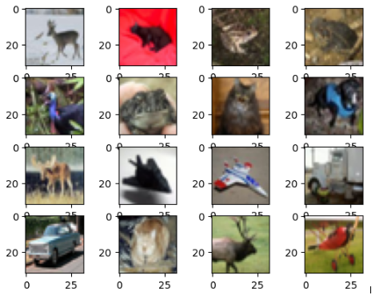
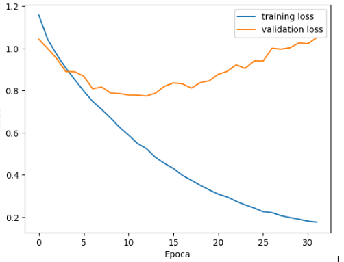
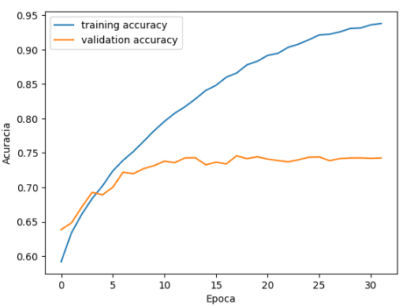
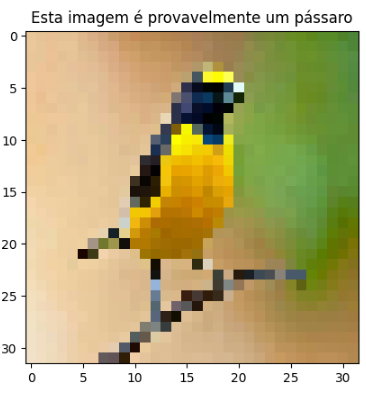
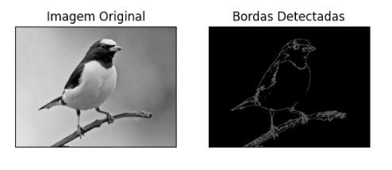
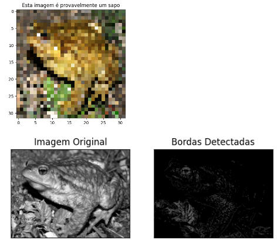
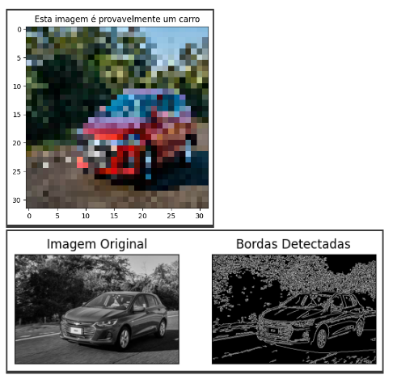
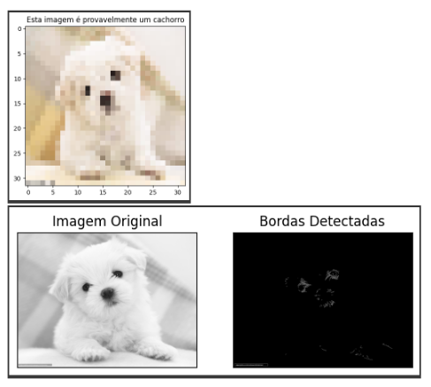

# REPORT: Neural Networks - Class Identification Algorithm Using the CIFAR-10 Database  
### GUAIBA, RS  
November 2, 2023  

## INTRODUCTION  

The objective of this report is to present code developed to train a neural network model capable of identifying different classes using the CIFAR-10 database from the Keras library. CIFAR-10 contains about 60,000 color images in 10 classes, with 6,000 images per class. Each image has a resolution of 32x32 pixels with three color channels (RGB).  

Thus, the model consists of a loss function, an optimizer, and evaluation metrics, training on both the training and test datasets while also assessing the test data. Predictions were generated for new images, and a plot of the neural network model's accuracy over epochs was created, as well as a loss plot using the Matplotlib library. The code was written in Python, using the following libraries: Keras, NumPy, Matplotlib, and TensorFlow.  

## DEVELOPMENT  

The first step in the code is to import the required libraries:  

```python
import keras
from keras.datasets import cifar10
import numpy as np
import matplotlib.pyplot as plt
from keras.models import Sequential
from keras.layers import Dense, Dropout, Conv2D , Flatten, MaxPooling2D
from keras.regularizers import l2
from keras.preprocessing.image import ImageDataGenerator
from keras.utils import to_categorical
import tensorflow as tf
```

### Libraries Overview  
- **Keras** - An open-source neural network library written in Python, designed for rapid experimentation with deep learning models.  
- **NumPy** - A Python library that supports multi-dimensional arrays and matrices, along with mathematical functions and operations.  
- **Matplotlib** - A library for generating graphs and visualizing data.  
- **TensorFlow** - An open-source machine learning and artificial intelligence library focused on training and inference of deep neural networks.  

The next step is to load the CIFAR-10 dataset. The first line of code assigns the images and their respective classes to the training and test sets. The second line prints the shape of the training dataset, which consists of 50,000 images with dimensions (32x32x3):  

```python
(x_train, y_train), (x_test, y_test) = cifar10.load_data()
x_train.shape
# Output: (50000, 32, 32, 3)
```

Then, 16 images from CIFAR-10 are plotted in a 4x4 grid. The code defines a loop that iterates 16 times. The second line sets up a subplot (4x4), assigning an index to each subplot. The third line plots the image from the training set:  

```python
for i in range(16):
    plt.subplot(4,4,i+1)
    plt.imshow(x_train[i+20])
```

The output is a grid of 16 images: 


Next, the shape of the training set is printed:  

```python
y_train.shape
# Output: (50000, 1)
```

### One-Hot Encoding  

The fourth step involves converting class labels into binary matrices using the `to_categorical` function. The first line converts the training set labels, while the second line processes the test set labels:  

```python
y_train = to_categorical(y_train)
y_test = to_categorical(y_test)
```

### Image Normalization  

The fifth step converts the images into floating-point matrices and normalizes pixel values by dividing them by 255:  

```python
x_train = x_train.astype('float32') / 255
x_test = x_test.astype('float32') / 255
```

### Defining a Convolutional Neural Network (CNN)  

The sixth step is to define a convolutional neural network (CNN) model using the Keras library. Thus, there is a ‘Conv2D’ layer with 32 filters, each with a kernel size of 3x3 and a ‘ReLU’ activation function. Next, a ‘MaxPooling2D’ layer with a pool size of 2x2 is added, followed by another ‘Conv2D’ layer with 64 filters, each with a kernel size of 3x3 and a ‘ReLU’ activation function. The second ‘Conv2D’ layer is followed by another ‘MaxPooling2D’ layer with a size of 2x2. A Flatten layer is also added, transforming the output of the previous layer into a one-dimensional vector. The one-dimensional vector is passed to a dense layer with 512 neurons and a ReLU activation function. Next, there is a dropout layer, which helps prevent overfitting by randomly dropping some of the outputs of the previous layer during training. Finally, there is a dense layer with 10 neurons and a softmax activation function, which produces the probabilities for each class: 

```python
cnn_model = Sequential()
cnn_model.add(Conv2D(filters=32, kernel_size=3, activation='relu', input_shape=(32, 32, 3)))
cnn_model.add(MaxPooling2D(pool_size=2))
cnn_model.add(Conv2D(filters=64, kernel_size=3, activation='relu'))
cnn_model.add(MaxPooling2D(pool_size=2))
cnn_model.add(Flatten())
cnn_model.add(Dense(units=512, activation='relu'))
cnn_model.add(Dropout(rate=0.5))
cnn_model.add(Dense(units=10, activation='softmax'))
```

### Model Compilation & Training  

The seventh step is to define the loss function as ‘categorical_crossentropy’, the optimizer as ‘adam’, and the metrics as ‘accuracy’. The model is then trained using the training and test data, with a batch size of 200 and 32 epochs:

```python
cnn_model.compile(loss='categorical_crossentropy', optimizer='adam', metrics=['accuracy'])
history = cnn_model.fit(x_train, y_train, batch_size=200, epochs=32, verbose=1, validation_data=(x_test, y_test))
```

### Model Evaluation  

Next, two variables, ‘test_loss’ and ‘test_accuracy’, are defined, which store the model’s loss and accuracy, respectively, calculated using the test data. The model’s loss and accuracy are then printed: 

```python
test_loss, test_accuracy = cnn_model.evaluate(x_test, y_test)
print('Loss:', test_loss)
print('Accuracy:', test_accuracy)
# Output: Loss: 1.051 Accuracy: 0.742
```

### Loss and Accuracy Graphs  

Loss graph:  

```python
plt.plot(history.history['loss'], label='training loss')
plt.plot(history.history['val_loss'], label='validation loss')
plt.xlabel('Epoch')
plt.ylabel('Loss')
plt.legend()
plt.show()
```



Accuracy graph:  

```python
plt.plot(history.history['accuracy'], label='training accuracy')
plt.plot(history.history['val_accuracy'], label='validation accuracy')
plt.xlabel('Epoch')
plt.ylabel('Accuracy')
plt.legend()
plt.show()
```

### Image Prediction  

Next, a JPEG image (image.jpeg) is loaded using the ‘load_img’ function and resized to 32x32 pixels. The image is then converted into an array and an extra dimension is added to the array, creating a batch with a single element. A list of classes corresponding to the 10 dataset classes is then defined:

```python
img = keras.preprocessing.image.load_img('image.jpeg', target_size=(32, 32))
img_array = keras.preprocessing.image.img_to_array(img)
img_array = tf.expand_dims(img_array, 0)
classes = ['airplane', 'car', 'bird', 'cat', 'deer', 'dog', 'frog', 'horse', 'ship', 'truck']

predictions = cnn_model.predict(img_array)
score = tf.nn.softmax(predictions[0])
print("Predicted class:", classes[np.argmax(score)])
print("Confidence: {:.2f}%".format(100 * np.max(score)))
```

### Edge Detection  

Thus, the previously loaded image is plotted and displayed, and finally, the image is loaded in grayscale, the Canny technique is applied to detect edges, and then the original image and the image with detected edges are displayed:

```python
import cv2
img = cv2.imread('image.jpeg', 0)
edges = cv2.Canny(img, 100, 200)
plt.subplot(121), plt.imshow(img, cmap='gray')
plt.title('Original Image'), plt.xticks([]), plt.yticks([])
plt.subplot(122), plt.imshow(edges, cmap='gray')
plt.title('Detected Edges'), plt.xticks([]), plt.yticks([])
plt.show()
```
### Bird:




Other images were also tested, with the following results:


### Frog:



### Car:


### Dog:




## CONCLUSION  

By analyzing the loss and accuracy tests, it is noted that, with an accuracy of 74% and a loss of 1.05, the model may be struggling to make accurate predictions, since a high loss and low accuracy can indicate that the model is suffering from underfitting, meaning it is not fitting the training data very well.

However, in the loss graph, it can be seen that the training loss starts at 1.2 in the first epoch and decreases to almost 0.2 by epoch 30, which means the model improves as it is trained. The same applies to the validation loss, which starts at 1.05 in the first epoch, decreases to 0.8 by epoch 10, and increases to about 1.1 by epoch 30. In the accuracy graph, the training accuracy starts at 0.59 in the first epoch and increases to 0.94 by epoch 30, indicating that the model improves as it is trained. The same goes for the validation accuracy, which starts at 0.64 in the first epoch and increases to about 0.74 by epoch 30, meaning the model is generalizing well to new data.

In one of the image tests, although not shown in the development section, an image of a bird with a green background was inserted, and the model identified it as a frog, indicating, as expected, that the model does not work correctly for all cases.

It's concluded, therefore, that the model does have some difficulty making accurate predictions in some cases. This can be improved later by increasing the number of neural network layers or by using regularization techniques such as L1 and L2.