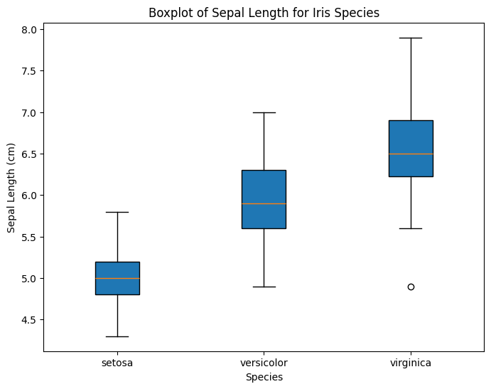
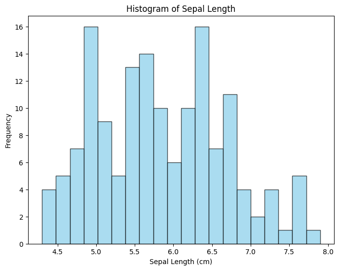
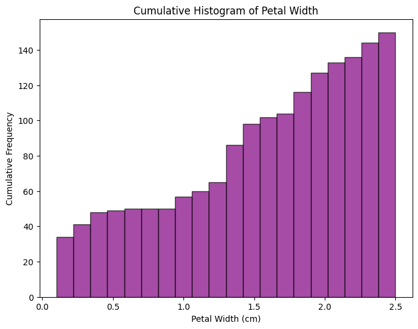
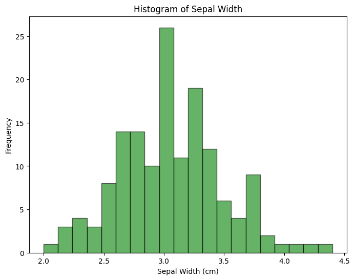
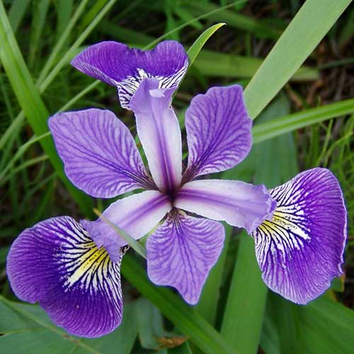
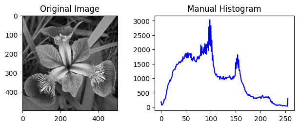
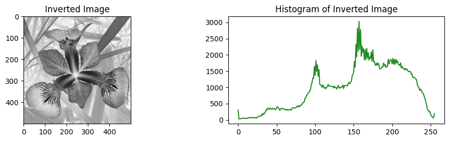

# Statistical Analysis and Data Visualization of the Iris Dataset Using Python

## INTRODUCTION

The objective of this report is to present a code developed to perform sampling, boxplot, maximum, minimum, range, percentile, two histograms, and a cumulative histogram of the data based on the Iris dataset. For the data percentile, the percentiles for the petal length of "Setosa," "Versicolor", and "Virginica" were chosen. Then, a histogram for the sepal length and another for the sepal width were created. As for the cumulative histogram, it was done for the petal width. Subsequently, an image of an iris flower was chosen, and a manual histogram was created using "for", using the function itself, and finally, the inverted image and its histogram. The Iris dataset consists of 150 samples of three Iris species: Iris Setosa, Iris Virginica, and Iris Versicolor. Four characteristics of each sample were measured: the length and width of the sepals and petals, in centimeters. The code was written in Python, using the ```pandas, matplotlib, sklearn, cv2```, and ```numpy``` libraries.

## Development

The first step of the code is to implement the libraries, which are:

```python
import pandas as pd
import matplotlib.pyplot as plt
from sklearn.datasets import load_iris
import cv2
import numpy as np
```

- **Pandas**: Pandas is a library that facilitates the manipulation and analysis of structured or tabular data.
- **Matplotlib**: Matplotlib is a library for creating graphs and data visualizations in general.
- **Sklearn**: Scikit-learn is an open-source library that contains tools for machine learning, such as functions for data preprocessing, model creation, result evaluation, etc.
- **OpenCV or cv2**: OpenCV, also known as cv2, is a widely used open-source library for image and video processing in Python. It offers a wide variety of functions and algorithms that allow for easy and efficient computer vision tasks.
- **NumPy**: NumPy is a library for the Python programming language that supports the processing of multi-dimensional arrays and matrices, along with a large collection of mathematical functions and operations due to its powerful array manipulation capabilities.

### a. Data Sampling
The second step is to load the Iris dataset, which contains information about the characteristics of three species (classes) of Iris flowers: Iris Setosa, Iris Versicolor, and Iris Virginica, with 50 samples each. It includes characteristics such as sepal length, sepal width, petal length, and petal width. The variable “iris_data” was created to store the Iris dataset as a DataFrame, using “data” to pass the Iris dataset and the “columns” argument to specify the column names, which are the characteristics of the flowers. Each value in the series represents a different class. Subsequently, the first five rows of the DataFrame are printed:

```python
iris = load_iris()
iris_data = pd.DataFrame(data=iris.data, columns=iris.feature_names)
print(iris_data.head())
```
```
   sepal length (cm)  sepal width (cm)  petal length (cm)  petal width (cm)
0                5.1               3.5                1.4               0.2
1                4.9               3.0                1.4               0.2
2                4.7               3.2                1.3               0.2
3                4.6               3.1                1.5               0.2
4                5.0               3.6                1.4               0.2
```

### b. Boxplot of the Data
The third step is to create a boxplot of the sepal length for Iris species. In the first line, a new plot with a width of 8 units and a height of 6 units is created. Subsequently, a boxplot is created to visualize the distribution of sepal length for the three Iris species:

```python
plt.figure(figsize=(8, 6))
plt.boxplot([iris_data[iris.target == i]["sepal length (cm)"] for i in range(3)], tick_labels=iris.target_names, patch_artist=True)
plt.title("Boxplot of Sepal Length for Iris Species")
plt.xlabel("Species")
plt.ylabel("Sepal Length (cm)")
plt.show()
```


### c. Maximum
The fourth step is to find the maximum petal length and print it:

```python
maximum_petal_length = iris_data["petal length (cm)"].max()
print(f"Maximum petal length: {maximum_petal_length:.2f} cm")
```
```Maximum petal length: 6.90 cm```

### d. Minimum
The fifth step is to find the minimum sepal length and print it:

```python
minimum_sepal_length = iris_data["sepal length (cm)"].min()
print(f"Minimum sepal length: {minimum_sepal_length:.2f} cm")
```
```Minimum sepal length: 4.30 cm```

### e. Range
The sixth step is to find the minimum petal length, as the maximum length has already been found. Then, the range is calculated and the result is displayed:

```python
minimum_petal_length = iris_data["petal length (cm)"].min()
range_petal_length = maximum_petal_length - minimum_petal_length
print(f"Range for Petal Length: {range_petal_length:.2f} cm")
```
```Range for Petal Length: 5.90 cm```

### f. Data Percentile
The seventh step is to calculate the percentiles of the petal length for Setosa, Versicolor, and Virginica and print them:

```python
print("\nPercentiles for Petal Length:")
print(f"Setosa: {np.percentile(iris_data[iris.target == 0]['petal length (cm)'], np.arange(0, 100, 25))}")
print(f"Versicolor: {np.percentile(iris_data[iris.target == 1]['petal length (cm)'], np.arange(0, 100, 25))}")
print(f"Virginica: {np.percentile(iris_data[iris.target == 2]['petal length (cm)'], np.arange(0, 100, 25))}")
```
```
Percentiles for Petal Length:
Setosa: [1.    1.4   1.5   1.575]
Versicolor: [3.   4.   4.35 4.6 ]
Virginica: [4.5   5.1   5.55  5.875]
```

To handle the percentiles, the quartiles are evaluated: the first quartile (Q1) is the value below which 25% of the data are located. The second quartile (Q2) is the median, which divides the data into 50% below and 50% above. The third quartile (Q3) is the value below which 75% of the data are located. Thus, for petal length, the following percentiles were obtained for each Iris species:

- **Setosa**: First quartile (Q1) is 1.0, median (Q2) is 1.4, and third quartile (Q3) is 1.5. The fourth value (1.575) represents the 87.5th percentile.
- **Versicolor**: First quartile (Q1) is 3.0, median (Q2) is 4.0, and third quartile (Q3) is 4.35. The fourth value (4.6) represents the 87.5th percentile.
- **Virginica**: First quartile (Q1) is 4.5, median (Q2) is 5.1, and third quartile (Q3) is 5.55. The fourth value (5.875) represents the 87.5th percentile.

### g. Histogram of the Data

The eighth step is to create a histogram of the data for sepal length, using a width of 8 units and a height of 6 units and plotting:

```python
plt.figure(figsize=(8, 6))
plt.hist(iris_data["sepal length (cm)"], bins=20, color="skyblue", edgecolor="black", alpha=0.7)
plt.title("Histogram of Sepal Length")
plt.xlabel("Sepal Length (cm)")
plt.ylabel("Frequency")
plt.show()
```

Histogram:



### h. Cumulative Histogram of the Data

The ninth step is to create a cumulative histogram for petal width:

```python
plt.figure(figsize=(8, 6))
plt.hist(iris_data["petal width (cm)"], bins=20, cumulative=True, color="purple", edgecolor="black", alpha=0.7)
plt.title("Cumulative Histogram of Petal Width")
plt.xlabel("Petal Width (cm)")
plt.ylabel("Cumulative Frequency")
plt.show()
```

Cumulative Histogram:



### i. Histogram of Sepal Width

The tenth and final step is to create a histogram for sepal width:

```python
plt.figure(figsize=(8, 6))
plt.hist(iris_data["sepal width (cm)"], bins=20, color="green", edgecolor="black", alpha=0.6)
plt.title("Histogram of Sepal Width")
plt.xlabel("Sepal Width (cm)")
plt.ylabel("Frequency")
plt.show()
```

Histogram of Sepal Width:



## 2) Histogram of an Image

### a. Choose an Image

The first step is to load the image of the Iris flower using the cv2.imread function in grayscale:

```python
image_path = "iris.jpg"
image = cv2.imread(image_path, cv2.IMREAD_GRAYSCALE)
```

Original chosen image:



### b. Manual Histogram

The second step is to manually calculate a histogram using a "for" loop and do it using the OpenCV function with 256 bins:

```python
hist_manual = np.zeros(256, dtype=int)
for pixel_value in image.flatten():
    hist_manual[pixel_value] += 1

hist_opencv = cv2.calcHist([image], [0], None, [256], [0, 256])
```

Subsequently, the original grayscale image and the manual histogram are plotted and printed:

```python
plt.subplot(2, 2, 1)
plt.imshow(image, cmap="gray")
plt.title("Original Image")
plt.subplot(2, 2, 2)
plt.plot(hist_manual, color="blue")
plt.title("Manual Histogram")
plt.tight_layout()
plt.show()
```


### c. Inverted Image and Histogram

The third step is to invert the image of the Iris flower and calculate the histogram of the inverted image:

```python
inverted_image = 255 - image
inverted_hist = cv2.calcHist([inverted_image], [0], None, [256], [0, 256])
```

Then, the inverted image and the histogram of the inverted image are plotted and printed:

```python
plt.figure(figsize=(12, 6))
plt.subplot(2, 2, 3)
plt.imshow(inverted_image, cmap="gray")
plt.title("Inverted Image")
plt.subplot(2, 2, 4)
plt.plot(inverted_hist, color="forestgreen")
plt.title("Histogram of Inverted Image")
plt.show()
```


## Conclusion

By analyzing the boxplot created for the sepal length of Iris species, it is seen that the box represents the interquartile range (IQR), which covers the first quartile (25%) to the third quartile (75%). It is also observed that the Setosa species generally has a shorter sepal length, while the Virginica species tends to have a longer sepal length.

In the percentiles, it is observed that the Setosa species tends to have shorter petal lengths, while the Virginica species has longer lengths. The Virginica species has a greater dispersion in petal lengths compared to the Setosa species. Thus, the Setosa species has a lower median (Q2) and a narrower range (Q3 - Q1), while the Virginica species has a higher median and the Versicolor species has a wider range. This suggests that the species have different distributions of petal length, which can be useful in classifying the species.

Regarding the histogram of sepal length, it is noted that there is a higher concentration of values around sepal lengths between 4.5 cm and 6.0 cm, meaning that most Iris flowers have sepal lengths in this range.

The cumulative histogram of petal width shows how the cumulative frequency of petal width values accumulates as we increase the intervals. In this case, the cumulative histogram seems to grow gradually, indicating that most Iris flowers have smaller petal widths. Approximately 60% of Iris flowers have petal widths less than 1.0 cm.

In relation to the histogram of sepal width, the distribution appears to be unimodal, with a single peak. The highest concentration of values is around sepal widths between 2.5 cm and 3.5 cm, meaning that most Iris flowers have sepal widths in this range. The peak at 3.0 cm suggests that this is a common sepal width and the position above 25% indicates that many flowers have this characteristic.

In the manual histogram of the Iris flower image, it is noted that the closer to pixel intensity 100, the higher the frequency of this intensity, reaching a peak of 3000 at pixel intensity 100. In the original image, the grayscale tones range from 0 (black) to 255 (white), while the inverted image is created by subtracting each pixel value from 255 (maximum value), resulting in an image with inverted intensities, i.e., lighter pixels become darker and vice versa.

In conclusion, the code allows for the exploration and visualization of important characteristics of Iris species, such as sepal length and width, petal width, and also the pixel intensities of the chosen image.